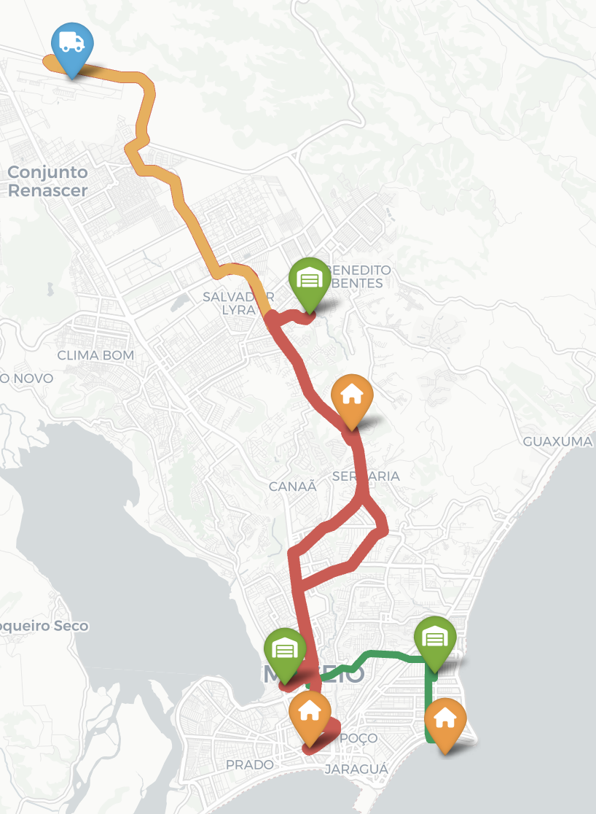

# Sistema de Otimização de Rede de Entregas

Este projeto, desenvolvido como parte de uma avaliação acadêmica, simula um sistema de otimização para uma rede de entregas logísticas. A aplicação modela a rede como um grafo e utiliza o algoritmo de Fluxo Máximo (com Ford-Fulkerson e Edmonds-Karp) para determinar a capacidade máxima de pacotes que podem ser transportados da origem aos destinos.

O sistema é composto por um ecossistema de micro-serviços e scripts que se comunicam via API, incluindo um backend central, um motor de cálculo, um visualizador de mapas e um simulador de cenários.

## 📍 Resultado Final

Abaixo, um exemplo do mapa interativo gerado pela aplicação, mostrando uma rede logística na cidade de Maceió, com suas rotas normais (verde) e críticas (vermelho), onde o fluxo está próximo da capacidade máxima.

****


## 🛠️ Tecnologias Utilizadas

- **Backend Principal:** Python, FastAPI
- **Motor de Cálculo:** Java, Spark Java
- **Visualização:** Python, Folium
- **Relatórios:** Python, FPDF2
- **Análise de Grafos:** Python, NetworkX
- **Comunicação:** API REST, HTTP, JSON
- **Ambiente:** Python Virtual Environment (venv)

## 📁 Estrutura do Projeto

O projeto está organizado da seguinte forma:

- **`main.py`**: A API central em FastAPI (tarefa do Dev 5).
- **`modelo_rede.py`**: As classes que modelam a rede (tarefa do Dev 1).
- **`simulador_dev4.py`**: O script que simula cenários e gera relatórios em PDF (tarefa do Dev 4).
- **`dev3/`**: Pasta contendo os artefatos da visualização.
  - **`app_visualizacao_integrado.py`**: Script que gera o mapa (tarefa do Dev 3).
  - **`dados_ficticios/rede_base.json`**: Arquivo com a estrutura da rede a ser analisada.
- **`Relatorio_de_Simulacao_de_Rede.pdf`**: Exemplo de relatório gerado pelo simulador.
- **`mapa_INTEGRADO.html`**: Exemplo de mapa gerado pelo visualizador.

## 🚀 Como Executar o Projeto

Siga os passos abaixo para rodar o sistema completo.

### Pré-requisitos
- Python 3.8+
- Java 11+ (para rodar o motor de cálculo localmente, se necessário)
- Um gerenciador de pacotes Python (pip)

### Passos para Execução

1.  **Clone o Repositório**
    ```bash
    git clone https://github.com/kauecavalcante/sistemaDeEntregas
    cd sistemaDeEntregas
    ```

2.  **Crie e Ative o Ambiente Virtual**
    ```bash
    python3 -m venv venv
    source venv/bin/activate
    # No Windows: .\venv\Scripts\Activate
    ```

3.  **Instale as Dependências**
    ```bash
    pip install "fastapi[all]" requests folium fpdf2 networkx
    ```

4.  **Execute o Sistema**

    O sistema precisa de **dois terminais** rodando simultaneamente.

    -   **Terminal 1: Inicie o Backend Principal (API FastAPI)**
        ```bash
        # Na raiz do projeto, com o venv ativo
        uvicorn main:app --reload
        ```
        Sua API estará disponível em `http://127.0.0.1:8000`. Ela já está configurada para usar a API de cálculo do Dev 2 que está hospedada online.

    -   **Terminal 2: Execute o Visualizador ou o Simulador**
        -   **Para gerar o mapa:**
            ```bash
            # Na raiz do projeto, com o venv ativo
            python dev3/app_visualizacao_integrado.py
            ```
            Abra o arquivo `mapa_INTEGRADO.html` gerado.

        -   **Para gerar o relatório em PDF:**
            ```bash
            # Na raiz do projeto, com o venv ativo
            python simulador_avancado_dev4.py
            ```
            Abra o arquivo `Relatorio_de_Simulacao_de_Rede.pdf` gerado.

## 🧑‍💻 Divisão de Tarefas

O projeto foi dividido entre 5 papéis de desenvolvedor:

-   **Dev 1 (Modelagem da Rede):** Responsável por criar as classes (`Deposito`, `Hub`, `Rota`, etc.) e a estrutura de dados em `modelo_rede.py`. Implementou a lógica para carregar dados de um JSON e validar a integridade da rede.

-   **Dev 2 (Implementação do Algoritmo):** Desenvolveu o motor de cálculo de fluxo máximo em uma API separada em Java, usando o algoritmo de Edmonds-Karp. A aplicação consome este serviço que está hospedado online.

-   **Dev 3 (Interface Gráfica e Visualização):** Criou o script `app_visualizacao_integrado.py` que consome a API principal, recebe os dados do fluxo calculado e gera um mapa interativo em HTML com a biblioteca Folium, representando visualmente os gargalos e a saúde da rede.

-   **Dev 4 (Simulador de Cenários):** Desenvolveu o `simulador_avancado_dev4.py`, um script que testa a resiliência da rede. Ele simula bloqueio de rotas, aumento de demanda e rotas prioritárias, gerando um relatório técnico detalhado em PDF com os resultados.

-   **Dev 5 (Backend, API REST e Integração):** O papel central do projeto. Desenvolveu a API principal em FastAPI (`main.py`) que serve como um orquestrador, conectando todos os outros módulos. É responsável por receber requisições, chamar o serviço de cálculo, processar os dados e entregá-los ao visualizador e simulador.

## ✍️ Autor

- Kauê Cavalcante W. 