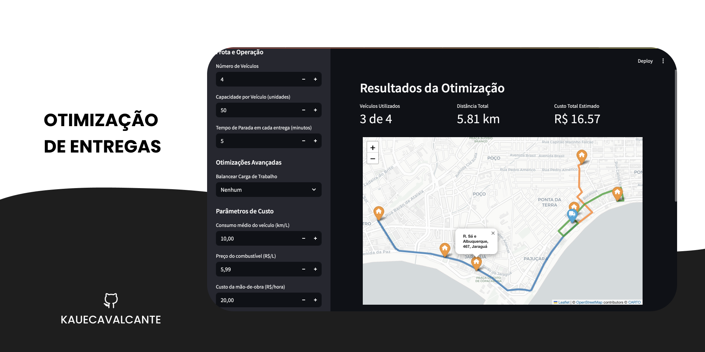

# Sistema de Otimização de Rede de Entregas

Este projeto, desenvolvido como parte de uma avaliação acadêmica, simula um sistema de otimização para uma rede de entregas logísticas. A aplicação modela a rede como um grafo e utiliza o algoritmo de Fluxo Máximo (com Ford-Fulkerson e Edmonds-Karp) para determinar a capacidade máxima de pacotes que podem ser transportados da origem aos destinos.

O sistema é composto por um ecossistema de micro-serviços e scripts que se comunicam via API, incluindo um backend central em FastAPI e uma interface de usuário interativa construída com Streamlit, que integra funcionalidades de visualização de mapas e simulação de cenários.

---

## 📍 Resultado Final

Abaixo, um exemplo do mapa interativo gerado pela aplicação, mostrando uma rede logística na cidade de Maceió, com suas rotas normais (verde) e críticas (vermelho), onde o fluxo está próximo da capacidade máxima.

****

---

## 🛠️ Tecnologias Utilizadas

* **Backend Principal:** Python, FastAPI
* **Frontend Interativo:** Python, Streamlit
* **Motor de Cálculo:** Java, Spark Java (consumido via API externa)
* **Visualização de Mapas:** Python, Folium
* **Geração de Relatórios:** Python, FPDF2
* **Análise de Grafos:** Python, NetworkX
* **Comunicação:** API REST, HTTP, JSON
* **Ambiente:** Python Virtual Environment (venv)

---

## 📁 Estrutura do Projeto

O projeto está organizado da seguinte forma:

* **`src/`**: Contém o código-fonte principal do projeto.
    * **`src/api/main.py`**: A API central em FastAPI, responsável por orquestrar as requisições.
    * **`src/app.py`**: A aplicação principal frontend interativa, desenvolvida com Streamlit.
    * **`src/core/modelo_rede.py`**: Classes e lógica para modelar a rede de entregas (depósitos, hubs, rotas).
    * **`src/core/solucionador_vrp.py`**: Módulo para algoritmos de solução de problemas de roteamento de veículos (VRP).
    * **`src/scripts/app_visualizacao_integrado.py`**: Script de suporte para a geração do mapa interativo.
    * **`src/scripts/simulador_dev4.py`**: Script de suporte para a simulação de cenários e geração de relatórios.
* **`data/`**: Pasta contendo arquivos de dados de entrada (ex: `rede_base.json`, `entregas.csv`, matrizes de distância/tempo).
* **`outputs/`**: Pasta onde os arquivos de saída (mapas HTML e relatórios PDF) são gerados.
* **`requirements.txt`**: Lista de todas as dependências Python do projeto.
* **`tests/`**: Pasta contendo testes unitários e de integração.
* **`.gitignore`**: Arquivo para ignorar arquivos e pastas não versionados pelo Git.

---

## 🚀 Como Executar o Projeto

Siga os passos abaixo para rodar o sistema completo.

### Pré-requisitos

* Python 3.8+
* Java 11+ (necessário apenas se for rodar o motor de cálculo Java localmente; o projeto está configurado para usar uma API hospedada online por padrão).
* Um gerenciador de pacotes Python (pip).

### Passos para Execução

1.  **Clone o Repositório**

    ```bash
    git clone [https://github.com/kauecavalcante/sistemaDeEntregas](https://github.com/kauecavalcante/sistemaDeEntregas)
    cd sistemaDeEntregas
    ```

2.  **Crie e Ative o Ambiente Virtual**

    ```bash
    python3 -m venv venv
    source venv/bin/activate
    # No Windows: .\venv\Scripts\Activate
    ```

3.  **Instale as Dependências**

    ```bash
    pip install -r requirements.txt
    ```

4.  **Execute o Sistema**

    O sistema precisa de **dois terminais** rodando simultaneamente para que a aplicação frontend (Streamlit) possa se comunicar com o backend (FastAPI).

    * **Terminal 1: Inicie o Backend Principal (API FastAPI)**
        Certifique-se de estar na raiz do projeto (onde está o arquivo `src/api/main.py`).

        ```bash
        uvicorn src/api/main:app --reload
        ```

        Sua API estará disponível em `http://127.0.0.1:8000`. Ela já está configurada para consumir a API de cálculo do Dev 2 que está hospedada online, não sendo necessário rodá-la localmente.

    * **Terminal 2: Inicie a Aplicação Frontend (Streamlit)**
        Abra um **novo terminal**, ative o ambiente virtual e navegue até a raiz do projeto.

        ```bash
        streamlit run src/app.py
        ```

        A aplicação Streamlit será aberta automaticamente no seu navegador padrão. Através dela, você poderá interagir com o sistema, visualizar mapas e gerar relatórios.

---

## 🧑‍💻 Divisão de Tarefas

O projeto foi dividido entre 5 papéis de desenvolvedor, com suas responsabilidades principais:

* **Dev 1 (Modelagem da Rede):** Responsável por criar as classes (**Deposito**, **Hub**, **Rota**, etc.) e a estrutura de dados em **`src/core/modelo_rede.py`**. Implementou a lógica para carregar dados de um JSON e validar a integridade da rede.
* **Dev 2 (Implementação do Algoritmo):** Desenvolveu o motor de cálculo de fluxo máximo em uma API separada em Java, usando o algoritmo de Edmonds-Karp. A aplicação principal consome este serviço que está hospedado online.
* **Dev 3 (Interface Gráfica e Visualização):** Criou o script **`src/scripts/app_visualizacao_integrado.py`** (consumido pela API e Streamlit) que gera um mapa interativo em HTML com a biblioteca Folium, representando visualmente os gargalos e a saúde da rede. A integração final para o usuário é feita via a aplicação Streamlit.
* **Dev 4 (Simulador de Cenários):** Desenvolveu o **`src/scripts/simulador_dev4.py`** (consumido pela API e Streamlit), um script que testa a resiliência da rede. Ele simula bloqueio de rotas, aumento de demanda e rotas prioritárias, gerando um relatório técnico detalhado em PDF com os resultados. A interação para a simulação é feita via a aplicação Streamlit.
* **Dev 5 (Backend, API REST e Integração):** O papel central do projeto. Desenvolveu a API principal em FastAPI (**`src/api/main.py`**) que serve como um orquestrador, conectando todos os outros módulos. É responsável por receber requisições do frontend, chamar o serviço de cálculo (Dev 2), processar os dados e entregá-los ao visualizador e simulador (Dev 3 e Dev 4), e servir a aplicação Streamlit.

---

## ✍️ Autor

* Kauê Cavalcante W.
